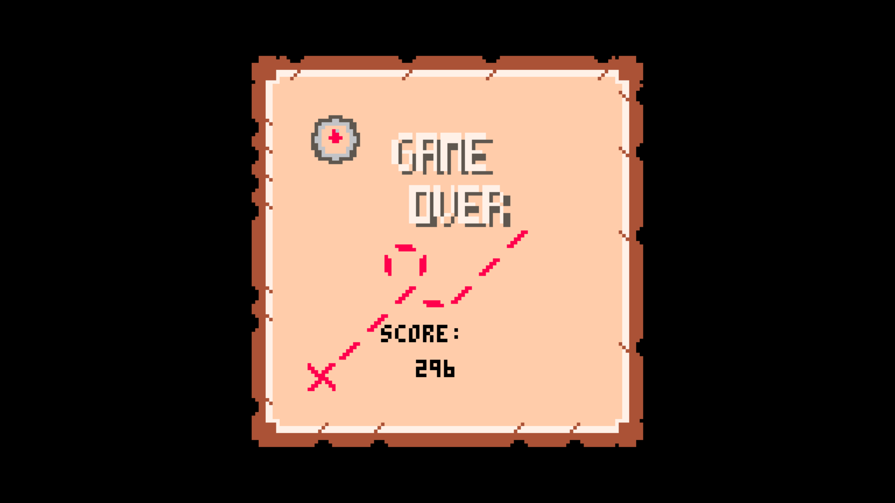

# RETROJAM 2017
Game made for Retrojam on November 26 2017

Name: Treasure Hunter

Theme: Discover

Idea: A game in which the protagonist has to discover strange islands as he sails the unknown seas of the ocean. On these islands he will find food for his journey and never seen treasures, but beware... as these treasures are carefully protected by the sneaky indigenous people who have the sole purpose of protecting their riches!

Fig1 - Main Menu

Fig2 - Sea phase

Fig3 - Island phase

Fig4 - Game Over

Credits:
* [Mário Fernandes](https://github.com/MarioFernandes73)
* [Catarina Ramos](https://github.com/catramos96)
* [Ines Gomes](https://github.com/inesgomes)
* [Miguel Freitas](https://github.com/miguelagfreitas)
* [Tomás Freitas](https://github.com/TomsFreitas)
